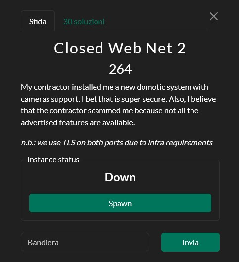
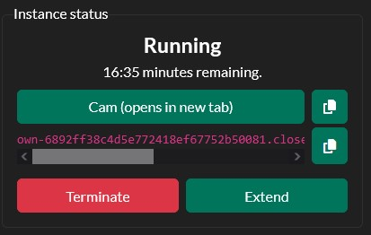
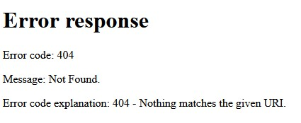
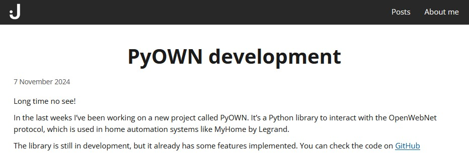

# [Misc] Closed Web Net 2
**Final Solves**: 30



---

## Solution



When we launch the challenge, we're given access to two services: **"Cam"** and **"Own"**. 
The "Own" service doesn't reveal anything useful right away, but the "Cam" service stands out: It behaves like a simple web server, however every request comes back with a **404 Not Found** error.




Still, there's one detail that stands out: the response includes **a suspicious header called grabtofile**. A quick [Google search](https://www.google.com/search?q="grabtofile") points us torwards the "**Open Web Net**" protocol, designed for managing electrical systems like lights, cameras, and intercoms. Even better, the first result is [The official PDF documentation](https://developer.legrand.com/uploads/2019/12/WHO_7.pdf) from BTicino/Legrand, detailing exactly how the protocol works.
From there, we also learn that Open Web Net runs by default on port 20000, the same one where the "Own" service is running on. With that, we finally know what protocol the service is listening.

Digging a bit further, we also stumble upon a Python library for interacting with the protocol: the only working implementation ([**"PyOwn"**](https://github.com/jotonedev/pyown)) I could find was written by someone from MadrHacks - the team organizing this CTF.



By adapting the **"Lights1"** example included in the library and poking around the code to understand how custom messages could be sent, I managed to put together a script:

```python
import asyncio
import logging
from pyown.client import Client

async def run(host: str, port: int, password: str):
    client = Client(host=host, port=port, password=password)

    await client.start()

    from pyown.messages import GenericMessage

    # Sending my custom message *7*0*4001## (OPCODE 0 -> Turn on)
    msg = GenericMessage(["7", "0", "4001"])
    await client.send_message(msg)
	
	# Sending my custom message *7*180*4001## (OPCODE 180 -> Better Quality)
    msg = GenericMessage(["7", "180", "4001"])
    await client.send_message(msg)

    await client.close()

def main(host: str, port: int, password: str):
    # Set the logging level to DEBUG
    logging.basicConfig(
        level=logging.DEBUG,
        format="%(asctime)s [%(levelname)s] %(name)s: %(message)s",
        datefmt="%Y-%m-%d %H:%M:%S",
    )

    # Run the asyncio event loop
    asyncio.run(run(host, port, password))


if __name__ == "__main__":
    import argparse

    parser = argparse.ArgumentParser()
    parser.add_argument(
        "--host", type=str, help="The host to connect to", default="192.168.1.53"
    )
    parser.add_argument(
        "--port", type=int, help="The port to connect to", default=20000
    )
    parser.add_argument(
        "--password",
        type=str,
        help="The password to authenticate with",
        default="12345",
    )

    args = parser.parse_args()

    main(args.host, args.port, args.password)
```

There was one problem: **Open Web Net doesn't support SSL natively**, so direct communication wouldn't work. After a bit of Googling, I discovered a quick workaround: I could spin up my own SSL tunnel using **stunnel**, and deploy it quickly with Docker, allowing the client to simply speak plain Open Web Net.

***Dockerfile***
```dockerfile
FROM alpine:latest
RUN apk add --no-cache stunnel
COPY stunnel.conf /etc/stunnel/stunnel.conf
EXPOSE 20000
CMD ["stunnel", "/etc/stunnel/stunnel.conf"]
```

***run.sh***
```sh
#!/bin/sh
# run.sh - start stunnel proxy

# Make sure the stunnel config exists
if [ ! -f /etc/stunnel/stunnel.conf ]; then
    echo "Error: /etc/stunnel/stunnel.conf not found"
    exit 1
fi

# Start stunnel in foreground
exec stunnel /etc/stunnel/stunnel.conf
```

***stunnel.conf***
```
# Global options
foreground = yes
client = yes

# Service definition
[own-ssl-proxy]
accept = 0.0.0.0:20000
connect = <OWN SERVICE HOSTNAME>:20000
```

With the proxy running, the script was able to turn on the camera and interact with the service correctly. Visiting `CAM/telecamera.php` finally revealed the flag:

```
snakeCTF{0pen_w3b_n3t_ag4in??_8b778cd4abdc7975}
```


**Disclaimer**
This post is not affiliated with BTicino or Legrand companies. Open Web Net is a registered trademark, and its documentation is freely available on the Legrand developer website.
